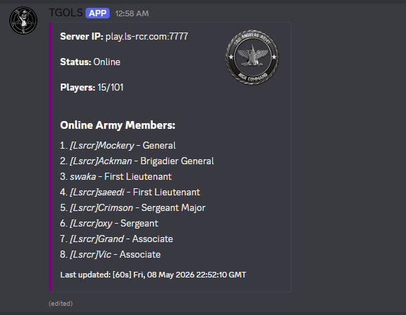

  

<h1 align="center">🪖 Army Embed Bot</h1>

  A lightweight <b>Discord.js</b> script that automatically generates and updates an  
  <b>army member list embed</b> for lsrcr server.

  

---

## ✨ Features

- 📋 **Live army roster embed** (auto-updates)
- ⚙️ Easy configuration via `scripts.js`
- 🏷️ Supports in-game tags (e.g. `[Lsrcr]Cover`)
- 🔄 Real-time SA-MP player syncing
- 📊 Clean rank-based sorting system
- 💬 Structured and readable Discord embed layout

---

## 📦 Requirements

Make sure you have the following installed:

- [`discord.js`](https://discord.js.org/)
- [`node-samp-query`](https://www.npmjs.com/package/node-samp-query)
- [`axios`](https://www.npmjs.com/package/axios)
- [`cheerio`](https://www.npmjs.com/package/cheerio)
- [`chalk v4.1.2`](https://www.npmjs.com/package/chalk/v/4.1.2)
---

   

